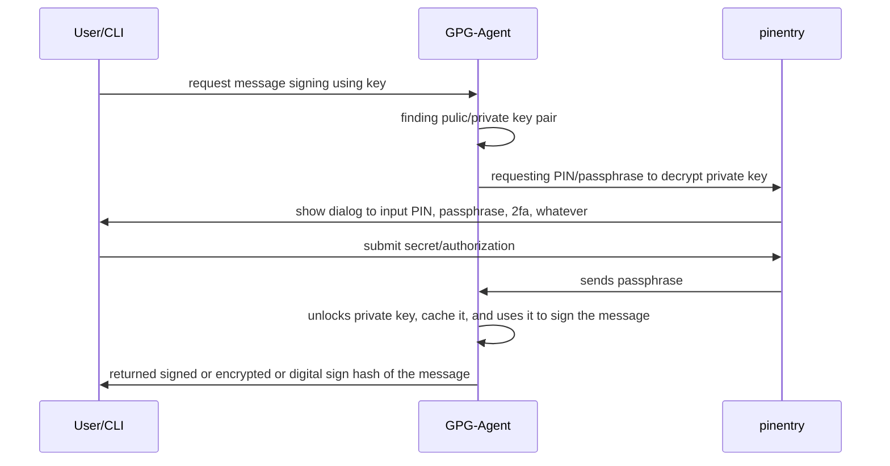

# pinentry_box

This is a python program.
Built with Poetry.
Any reference to relative path is relative to the directory where this README is located.

## Development

This development stack uses Nix Flake + Direnv.
In this directory, run:

```shell
direnv allow
```

Then it will fetch the current dependency and project setup.
Your shell will then use the correct python version.
If you need to integrate to IDE or other Python integration, use Poetry.

When you use IDE, it is recommended to open the project from this directory where the README is located.
This way, integrated terminal will automatically open the correct Poetry project setup.

### Build

Run

```shell
# using Make
make build
```

or using Nix

```shell
# using nix
nix build .
```

The build output is in the `result` directory (a non-writable symlink).

### Test run the pinentry_box CLI

We have convenient function in the Makefile:

```shell
make run-pinentry-box
```

This will run pinentry in interactive mode, proxying to the default `pinentry-mac` on MacOS.
Note: we currently have no Linux dev support, although it can easily be forwarded to `pinentry-curses` or `pinentry-gtk`

You can also run using poetry as usual

```shell
poetry run pinentry_box
```

Poetry will run it in development mode. To test the build mode, use the executable inside the build directory

```shell
./result/bin/pinentry_box
```

If you want to test in arbitrary environment that has Nix Flake enabled, just run it using `nix run`.
Note: we currently have no Linux dev support, although it can easily be forwarded to `pinentry-curses` or `pinentry-gtk`

```shell
# using github URI (no need to clone)
nix run 'github:lucernae/pinentry-box/main?dir=pinentry_box'
# you can replace 'main' with other branch or ref
```

```shell
# if you already cloned the repository
nix run '<location of the flake.nix file'
```

### Hooking up with gpg-agent

GPG usually put the config file in `~/.gnupg/gpg-agent.conf`.
Replace or add the `pinentry-program` key with the absolute path location of the `./result/bin/pinentry_box` program.
The program in `./result/bin/pinentry_box` is a poetry scripts in editable mode.
So if you modify existing files in the project, it should be in effect immediately.

## GPG cookbook

### General Architecture

GPG Agent and Pinentry communicate using Assuan Protocol.
In this scenario, Pinentry program takes the role of **Assuan Server** and GPG Agent is its **Assuan Client**
Specifically, they communicate either via stdin/stdout or socket.
This is a sample communication when signing a message.



Note: above sequence might be inaccurate, can be fixed as we go

### Sign message using GPG2

This article is a good and beginner friendly: https://www.digitalocean.com/community/tutorials/how-to-use-gpg-to-encrypt-and-sign-messages

Assuming most user-friendly OSes will have GPG2 installed anyway, here's the cookbook for doing things using GPG

Encrypting message

```shell
# replace lana.pcfre@gmail.com with your own email that has GPG keys
gpg --trust-model always --encrypt --sign --armor -r lana.pcfre@gmail.com -o tmp/testfile.txt.asc testfile.txt
```

Decrypting message

```shell
gpg tmp/testfile.txt.asc
```
